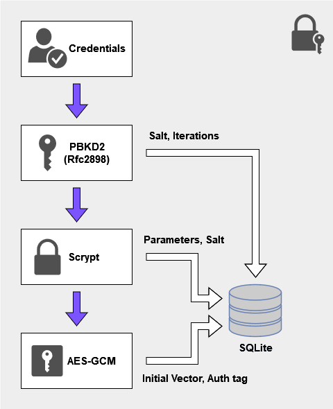

# Crypto mini-project
The goal of the following project is to make a password manager.

## Security model

  

  

The user's password is used as an initial input. Password-Based Key Derivation Function 2 ([PBKDF2](https://en.wikipedia.org/wiki/PBKDF2)) using HMAC-SHA512, also called RFC2898, is used as a first barrier of security by computational work.
Next, the [Scrypt](https://en.wikipedia.org/wiki/Scrypt) hash algorithm is applied to the previously derived key.  
The resulting hash is then used as a key for AES-GCM to encrypt and decrypt the passwords stored in the SQLite database.

### Attack vectors
The above security model is ineffective if the underlying system is compromised by a keylogger, or another form of data collector.  

Given that two layers of hashing algorithms that are computationally expensive are used, the risk of brute forceing attacks are lowered substantially. However, the user should still take care not to use a password of short length.
