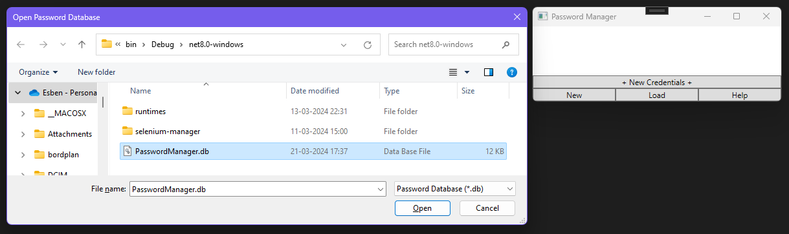
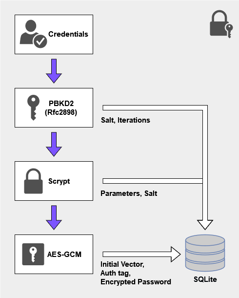

# Crypto mini-project
The goal of the following project is to make a password manager.

## Running the Password Manager
As this project is constructed using C#/WPF, the easiest course of action is to download and install the latest version of Visual Studio.  
The solution can then be opened, and compiled to a binary using the graphical interface, or run in the debugger.

## Screenshots

  
  

  

  
  

## Security discussion
- The average user of the internet, as of today, needs to keep track of a lot of passwords and credentials.  
- Entities with malicious intentions are a constant worry for IT companies. By gaining access to systems with flawed security, the threat actors are able to gain access to passwords of end-users, which they can use to gain further access to services that the end-users might posses.

In order to withstand compromise of a service, such that other services are not compromised as well, it is essential to use unique passwords for each service.
This is where the concept of a password manager comes increasingly more useful: by centralizing all the passwords to a single container, and putting a master lock onto it.  

### Security model

  

  

The user's password is used as an initial input. Password-Based Key Derivation Function 2 ([PBKDF2](https://en.wikipedia.org/wiki/PBKDF2)) using HMAC-SHA512, also called RFC2898, is used as a first barrier of security by computational work.
Next, the [Scrypt](https://en.wikipedia.org/wiki/Scrypt) hash algorithm is applied to the previously derived key.  
The resulting hash is then used as a key for AES-GCM to encrypt and decrypt the passwords stored in the SQLite database.

### Attack vectors & pitfalls
The above security model is ineffective if the underlying system is compromised by a keylogger, or another form of data collector, or any form of backdoor.  

Given that two layers of hashing algorithms, that are computationally expensive, are used, the risk of brute forceing attacks are lowered substantially. However, the user should still take care not to use a password of short length.

## Limitations
At it's current state, it is possible to specify a service name, username, and password; only the password is encrypted.

